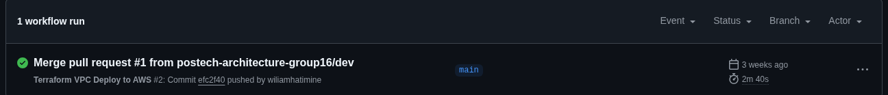

<h3 align="center">VPC</h3>

<h3 align="center">Descrição ⚡</h3>

<h3>VPC - Virtual Private Cloud - Permite criar uma rede isolada dentro da AWS, onde você pode lançar recursos (como instâncias EC2) com controle total sobre IPs, sub-redes, rotas e firewalls. <h3>

### 👨‍💼 Desenvolvido por

### Github Actions - Runs

